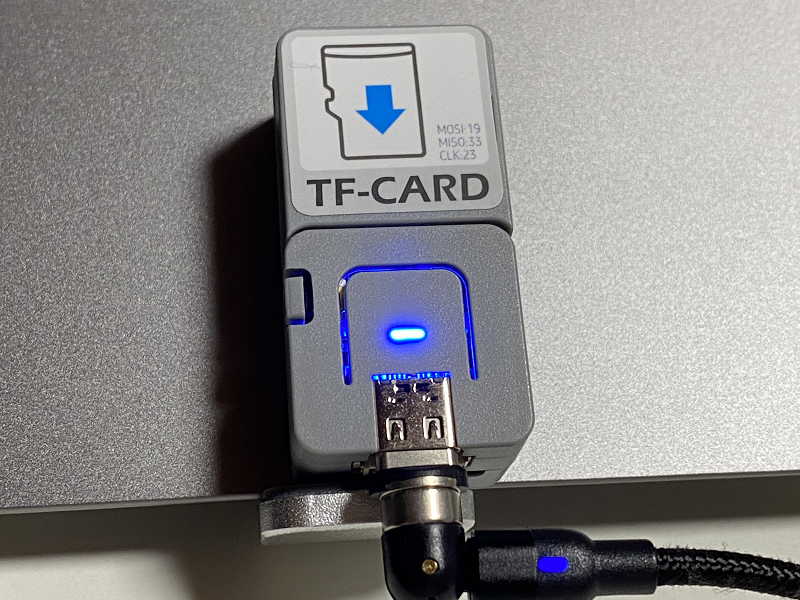

# AtomicTF_RunCPM_BTSerial
ATOMIC TFカードキットで動く超小型CP/Mマシン

  

これは、RunCPMをM5Stack ATOMIC TFカードキットで動くようにしたものです。 
PC等とBluetooth SPPで接続し、ターミナルエミュレーターを接続して使用します。

オリジナルはこちら。 
RunCPM - Z80 CP/M 2.2 emulator <https://github.com/MockbaTheBorg/RunCPM> 

---

### 必要な物 ###
* [ATOMIC TFカードキット](https://www.switch-science.com/catalog/6475/ "Title") 
* Arduino IDE (1.8.13で動作確認をしました。) 
* [Arduino core for the ESP32](https://github.com/espressif/arduino-esp32 "Title")
* [SDdFatライブラリ](https://github.com/greiman/SdFat "Title") (1.1.4で動作確認をしました。2.x.xではコンパイルエラーになります。)
* [FastLEDライブラリ](https://github.com/FastLED/FastLED "Title")
* microSD カード (16GB以下のもの)
* 「Tera Term」などのターミナルエミュレーター 

ライブラリはArduino IDEの[スケッチ | ライブラリをインクルード |ライブラリを管理...] からインストールすると簡単です。

---

### 使用方法(Windows 10の場合) ###
1. PCとBluetoothでペアリングをします。(デバイス名は"Atomic CP/M"です。) 
2. ペアリングが上手くいくとCOMポートが２つ追加されます。 
3. 追加されたどちらかのCOMポートに「Tera Term」などのターミナルエミュレーターで接続します。 
4. 上手く接続できなかったときはもう一方のCOMポートで試してみてください。 
5. 接続が上手くいけばこのような画面が表示されます。  
 
 

---

### 参考資料 ###
RunCPM用のディスクの作り方などは、DEKO（@ht_deko）さんのこちらの記事を参照してください。 

* [RunCPM (Z80 CP/M 2.2 エミュレータ)](https://ht-deko.com/arduino/runcpm.html "Title")   

